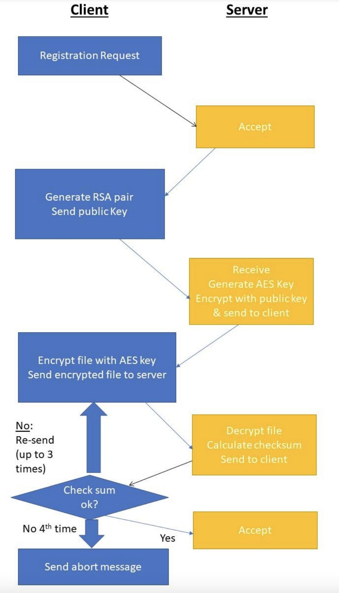

## About The Project
This project defines a client according to the final project requirements for
the Defensive Programming course in the Open University. The client is
defined with a specific set of rules for which requests should be handled
and how. Every request is expected to consist of a specific format, which
is represented in the code with matching structs defined in `ProtocolHandler.h`.
RequestCodes & ResponseCodes are enums that define different possible
values for the requests & responses to and from the server.
```c++
struct Request {
    char clientId[16];
    char version;
    uint16_t code;
    uint32_t payloadSize;
    char* payload;
};

struct Response {
    char version;
    uint16_t code;
    uint32_t payloadSize;
    std::string payload;
};
```

## Notes:
Please note that the quality of the code in this project may not entirely
reflect my usual standards. Due to the situation right now, and myself
being a 8200 graduate, I was called for reserved duty in the army and had
to expedite the development process accordingly. This has impacted my ability
to refine, optimize and test the codebase as I would typically prefer.

## Flows
### Registration Flow:

### Reconnection Flow:


## Contact
Erez Drutin - drutinerez3@gmail.com

